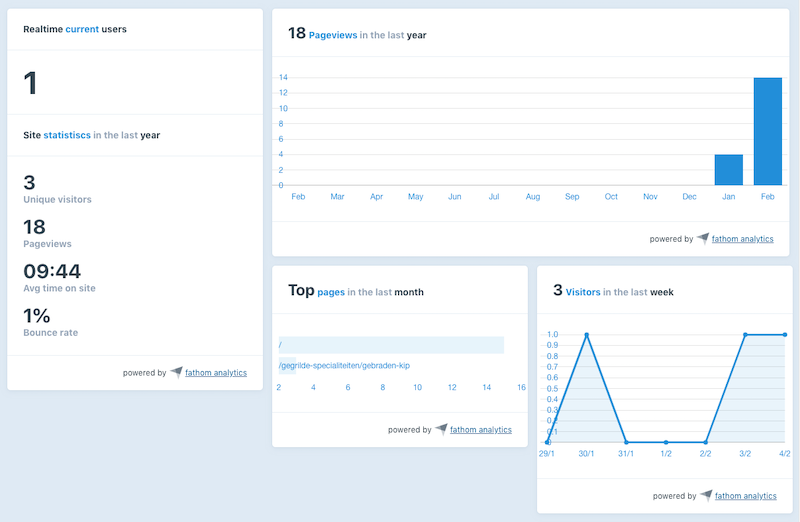

# Fathom Analytics for Craft CMS

Statistics and chart widgets for Fathom analytics.



## A word about privacy, GDPR and cookie banners

If you care about privacy and use Google Analytics on your site, I encourage you to read some of my toughts, explaining how the majority of sites are not in comply with Europe's GDPR and PECR regulations.

TL;DR

[Fathom](https://usefathom.com/) is a Google Analytics alternative. They offer [Fathom Lite](https://github.com/usefathom/fathom), which is free and you can self-host. Thereby no data is being shared with third party services. 

Although Fathm does not collect any personally identifiable information (and is GDPR compliant), it currently still uses a cookie. If you need a cookie-free solution, I suggest switching to Fathom Pro. Fathom Lite might become cookie-free in a future update though 🤞.

## Requirements

This plugin requires Craft CMS 3.0.0-beta.23 or later and [Fathom Lite](https://github.com/usefathom/fathom)

## Installation

To install the plugin, follow these instructions.

1. Open your terminal and go to your Craft project:

        cd /path/to/project

2. Then tell Composer to load the plugin:

        composer require stenvdb/fathom-analytics

3. In the Control Panel, go to Settings → Plugins and click the “Install” button for Fathom Analytics.

## Fathom Analytics Overview

This plugin **only works with Fathom Lite**, the self-hosted open source version. Reasons being Fathom does not have an official documented API. Once Fathom releases a documented API ([which might be in the works](https://trello.com/c/wu4WMy4U/16-api)), I'll consider providing support for Fathom Pro. In the meantime, this plugin uses Fathom's already great internal API. 

But working with Fathom Lite has its advantages, since you're self-hosting the app, which is [super easy](https://github.com/usefathom/fathom/blob/master/docs/Installation%20instructions.md), you're not sharing any data with third party services. I don't have to explain you this has its privacy beneftis.

## Configuring Fathom Analytics

This plugin obviously requires Fathom running on one of your servers. Once it is up and running, configure Fathom Analytic's settings:

```
// The domain name where Fathom is hosted. This is also the URL where the tracker code is pointed to.
'baseUri' => getenv('EXAMPLE_BASE_URI'),

// The tracking ID of this site. You can find the ID in your tracking code snippet, e.g.: ABCDE
'trackingId' => ABCDE,

'username' => getenv('EXAMPLE_USERNAME'),

'password' => getenv('EXAMPLE_PASSWORD')
```

## Fathom Analytics Roadmap

* Support Fathom Pro
* Entry tracking report field (on a per entry basis)
* Have an idea? [Let me know](https://stenvdb.be/contact)

Brought to you by [Sten Van den Bergh](https://stenvdb.be)
