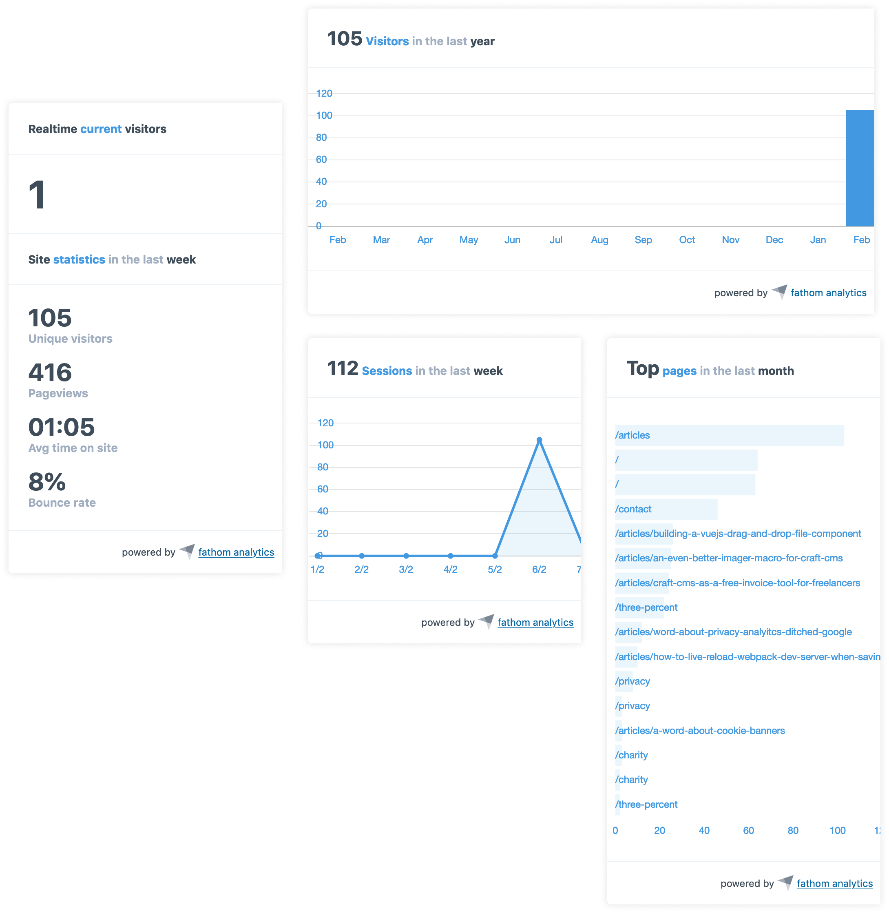

# Fathom Analytics for Craft CMS

Statistics and chart widgets for Fathom Lite.



## A word about privacy & Fathom

If you care about privacy and website-analytics, I encourage you to [read some of my toughts about it](https://stenvdb.be/articles/problem-with-website-analytics), explaining why I made the move from Google Analytics to Fathom.

**TL;DR**

[Fathom](https://usefathom.com/) is a Google Analytics alternative. They offer [Fathom Lite](https://github.com/usefathom/fathom), which is free and you can self-host. Thereby no data is being shared with third party services. 

Although Fathom Lite **does not collect any personally identifiable information** (and is GDPR compliant), it currently still uses a cookie (and is not PECR compliant without a cookie notice). If you need a cookie-free solution, I suggest switching to Fathom Pro. Fathom Lite might become cookie-free in a future update though 🤞.

## Requirements

This plugin requires Craft CMS 3.0.0-beta.23 or later and [Fathom Lite](https://github.com/usefathom/fathom)

## Installation

To install the plugin, follow these instructions.

1. Open your terminal and go to your Craft project:

        cd /path/to/project

2. Then tell Composer to load the plugin:

        composer require stenvdb/craft-fathom-analytics

3. In the Control Panel, go to Settings → Plugins and click the “Install” button for Fathom Analytics.

## Fathom Analytics Overview

This plugin **only works with Fathom Lite**, the self-hosted open source version. Reasons being Fathom does not have an official documented API. Once Fathom releases a documented API ([which might be in the works](https://trello.com/c/wu4WMy4U/16-api)), I'll consider providing support for Fathom Pro. In the meantime, this plugin uses Fathom's already great internal API. 

## Configuring Fathom Analytics

This plugin obviously requires Fathom running on one of your servers. Once it is up and running (which is [super easy](https://github.com/usefathom/fathom/blob/master/docs/Installation%20instructions.md)), configure Fathom Analytic's settings in a `config/fathom-anaytics.php` file (multi-site config is supported). See an example below:

```
<?php

return array(
    '*' => array(
        // The domain name where Fathom is hosted. This is also the URL where the tracker code is pointed to.
        'baseUri' => '$FATHOM_BASE_URI',

        // The tracking ID of this site. You can find the ID in your tracking code snippet, e.g.: ABCDE
        'trackingId' => '$FATHOM_TRACKING_ID',

        // You can also use multi-site config values, e.g.
        // 'trackingId' => [
        //     'default' => '$FATHOM_TRACKING_ID',
        //     '<...>' => '<...>'
        // ]

        'username' => '$FATHOM_USERNAME',

        'password' => '$FATHOM_PASSWORD',

        // Automatically inject a tracking script in your site
        'injectTracking' => false,
    ),
    'production' => [
        'injectTracking' => true,
    ],
);
```

## Tracking Code Snippet

When enabling `injectTracking` setting, the tracking snippet (editable in the plugin settings) will automatically be injected into the head section of your site.
This is disabled by default. 

Alternatively you can use the following code snippet to force the code injection in your template:

```

``` 

## Fathom Analytics Roadmap

* Support Fathom Pro
* Entry tracking report field (on a per entry basis)
* Have an idea? [Let me know](https://stenvdb.be/contact)
